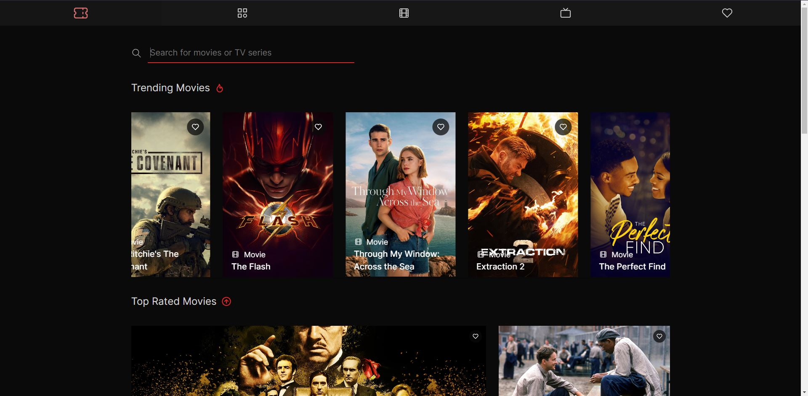

# Entertainment-web-app

Este proyecto lo hice basandome en el reto de [Frontend Mentor](https://www.frontendmentor.io/challenges/entertainment-web-app-J-UhgAW1X) y le agregué mas cosas para fortalecer mis habilidades en React, cosas como el uso de Context, useMemo, useCallback, useReft, ReactRouter y demás herramientas de React. La App consiste en una Web App de entretenimiento donde se puede buscar una pelicula/serie agregarla a favoritos si estás logeado y navegar entre rutas.
> 👷‍♂️ Sigue en desarrollo constante, por ahora solo está hecho el diseño.
> 

## Live demo

> Cuando lo tenga lo pongo
> 

## **Tecnologias/recursos**

- [React](https://react.dev/)
- [Tabler Icons](https://tabler-icons.io/)
- [keen slider](https://keen-slider.io/)
- [TypeScript](https://www.typescriptlang.org/)
- [React Router](https://reactrouter.com/en/main)
- [Vitejs](https://vitejs.dev/) (con Css-modules)
- [OMDB Api](https://omdbapi.com/)

## Caracteristicas

- [ ]  Responsive layout (mobile/tablet/desktop)
- [ ]  Login/Register
- [ ]  Buscar Series/Peliculas
- [ ]  Agregar a favoritos

## Imagen del proyecto

